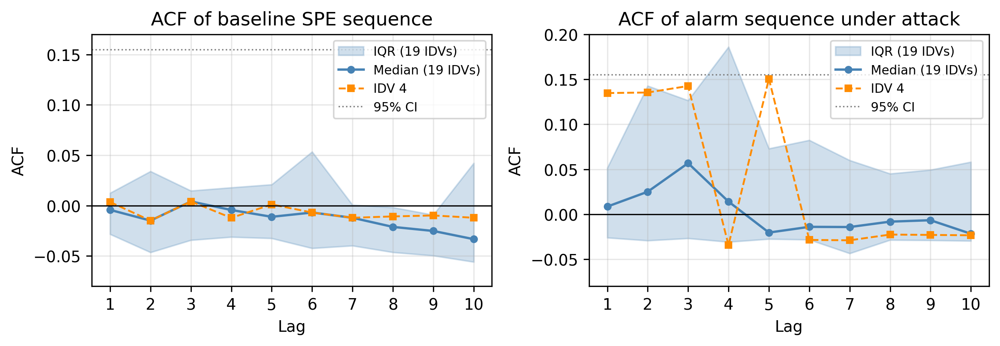
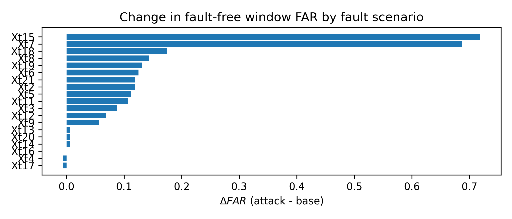
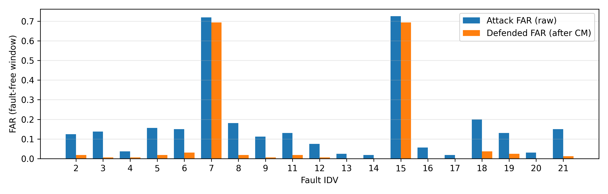

# FDIA Alarm Defense — False Data Injection Attacks on Industrial Fault Detectors

[](https://ieeexplore.ieee.org)
[](https://www.python.org)
[](https://www.kaggle.com/datasets/averkij/tennessee-eastman-process-simulation-dataset)
[](LICENSE)

---

## 📄 Associated Publication

> **A Novel False Data Injection Attack Threat Model Targeting Industrial Fault Detectors and Corresponding Countermeasures**
>
> Yuchen Jiang\*, **Christian E. Bamogo**, André M. H. Teixeira, Jingwei Dong, Hao Wang, Ming Liu, and Hao Luo
>
> *IEEE Transactions on Industrial Informatics* — Accepted for publication, 2026
> Paper ID: TII-26-5321

---

## 🔍 Overview

This repository contains the full implementation of the research presented in the paper above.

Modern industrial processes rely on **data-driven fault detectors** (e.g., DAE-PCA, KPCA) to trigger alarms when anomalies occur. This work exposes a critical and previously underexplored vulnerability: **False Data Injection Attacks (FDIAs) can maliciously inflate the False Alarm Rate (FAR) of these detectors**, causing alarm flooding and misleading operators into unnecessary fault searches.

### Key Contributions

- **Novel FDIA Threat Model** — a practically plausible attacker model targeting the *monitoring layer* (not the control layer), with sparse channel intrusion and mild assumptions on attacker capability
- **Chattering Alarm Attack** — a novel FDIA scheme using a temporal-spatial dual trigger mechanism to maximize alarm flooding
- **Precise FAR Control** — a method for mapping attack parameters to alarm frequency, enabling targeted adjustment of how often alarms fire
- **Countermeasures** — robustness enhancement via threshold adaptation and delay-timer mechanisms that effectively resist the proposed attacks

### Key Result

> The proposed FDIA scheme increases the False Alarm Rate (FAR) of the DAE-PCA fault detector by **10% on average** across 21 TEP fault scenarios, while remaining stealthy to standard detection baselines.

---

## 🏗️ Repository Structure

```
fdia-alarm-defense/
│
├── src/                          # Core implementation
│   ├── main.py                   # Main experiment runner
│   ├── model.py                  # DAE-PCA model definition
│   ├── dataset.py                # TEP dataset loader
│   ├── config.py                 # Experiment configuration
│   ├── attack_generator.py       # FDIA attack generation
│   ├── exp_harness.py            # Experiment harness (full pipeline)
│   ├── thresholds.py             # FAR/SPE threshold computation
│   ├── compute_act.py            # Activation computation
│   ├── visualize_attacks.py      # Attack visualization
│   ├── make_figs.py              # Publication-quality figure generation
│   └── utils.py                  # Utility functions
│
├── notebooks/
│   └── demo_experiment.ipynb     # Reproducible demo on TEP Fault 5
│
├── figs/                         # Key result figures from the paper
│   ├── acf_spe_alarm.png
│   ├── countermeasures_block2.png
│   ├── expC_attack_vs_defended_scatter_B.png
│   ├── expC_defended_far_B.png
│   ├── far_lift_bar.png
│   └── kc_effect.png
│
├── data/
│   └── README_data.md            # Instructions to download TEP dataset
│
├── requirements.txt
├── .gitignore
└── LICENSE
```

---

## ⚙️ Installation

```bash
git clone https://github.com/ChrislyTech/fdia-alarm-defense.git
cd fdia-alarm-defense
pip install -r requirements.txt
```

---

## 🚀 Quick Start

### 1. Download the dataset

Follow the instructions in [`data/README_data.md`](data/README_data.md) to download the **Tennessee Eastman Process (TEP)** benchmark dataset and place it in the `data/` folder.

### 2. Run the main experiment

```bash
cd src
python main.py
```

This runs the full attack pipeline on the DAE-PCA detector for the default fault scenario (IDV5) and outputs results and figures.

### 3. Reproduce all figures

```bash
cd src
python make_figs.py
```

### 4. Interactive demo

Open and run the notebook for a step-by-step walkthrough:

```bash
jupyter notebook notebooks/demo_experiment.ipynb
```

---

## 🧪 Experimental Setup

| Component | Details |
|---|---|
| **Benchmark** | Tennessee Eastman Process (TEP) — 21 fault scenarios (IDV1–IDV21) |
| **Fault Detector** | DAE-PCA (Deep Autoencoder-based Principal Component Analysis) |
| **Monitoring Statistic** | SPE (Squared Prediction Error) |
| **Attack Type** | False Data Injection Attack (FDIA) — chattering alarm variant |
| **FAR Target Range** | 3%, 10%, 20%, 25%, 30%, 40%, 50% |
| **Key Metric** | False Alarm Rate (FAR) lift under attack vs. baseline |

---

## 📊 Selected Results

### Attack effectiveness across fault scenarios

The FDIA scheme successfully elevates the FAR across all 21 TEP fault scenarios with an average FAR lift of **~10 percentage points**.

*(See `figs/` for full experimental figures)*

### Figures

| | |
|---|---|
|  |  |
| *SPE monitoring statistics under normal conditions vs. FDIA attack* | *FAR lift across 21 TEP fault scenarios under the proposed FDIA scheme* |


*FAR comparison: baseline vs. under attack vs. after countermeasure*

### Summary Results

| Metric | Value |
|---|---|
| Fault scenarios tested | 21 (IDV1–IDV21) |
| Average FAR lift under attack | ~10 percentage points |
| FAR target range evaluated | 3%, 10%, 20%, 25%, 30%, 40%, 50% |
| Countermeasure FAR recovery | Returns to near-baseline |
| Attack type | Chattering alarm (temporal-spatial dual trigger) |
| Detector type | DAE-PCA (SPE statistic) |

---

## 🔗 Related Work & Dependencies

- **TEP Dataset**: Downs & Vogel (1993) — available on [Kaggle](https://www.kaggle.com/datasets/averkij/tennessee-eastman-process-simulation-dataset)
- **DAE-PCA Baseline**: Ren et al. (2024), *Journal of Industrial Information Integration*
- **Alarm Management Standards**: ISA-18.2 (2009), EEMUA 191 (2024)

---

## 🔮 Roadmap / Future Work

- [x] FDIA threat model on DAE-PCA detectors (this work)
- [x] Chattering alarm attack with FAR control
- [x] Delay-timer and threshold adaptation countermeasures
- [ ] Extension to KPCA-based detectors
- [ ] DRL-based adaptive attack generation (Chapter 3, in progress)
- [ ] Real-time deployment on edge industrial hardware
- [ ] Generalization to multi-sensor networked CPS

---

## 📖 Citation

If you use this code in your research, please cite our paper:

```bibtex
@article{jiang2026fdia,
  title   = {A Novel False Data Injection Attack Threat Model Targeting Industrial
             Fault Detectors and Corresponding Countermeasures},
  author  = {Jiang, Yuchen and Bamogo, Christian E. and Teixeira, Andr{\'e} M. H.
             and Dong, Jingwei and Wang, Hao and Liu, Ming and Luo, Hao},
  journal = {IEEE Transactions on Industrial Informatics},
  year    = {2026},
  note    = {Accepted for publication, Paper ID: TII-26-5321}
}
```

---

## 🤝 Authors

| Author | Affiliation |
|---|---|
| **Yuchen Jiang** *(Corresponding)* | School of Astronautics, Harbin Institute of Technology, China |
| **Christian E. Bamogo** | School of Astronautics, Harbin Institute of Technology, China |
| **André M. H. Teixeira** | Department of Information Technology, Uppsala University, Sweden |
| **Jingwei Dong** | Division of Systems and Control, Uppsala University, Sweden |
| **Hao Wang** | School of Astronautics, Harbin Institute of Technology, China |
| **Ming Liu** | Harbin Institute of Technology, China |
| **Hao Luo** | School of Astronautics, Harbin Institute of Technology, China |

---

## 📬 Contact

Christian E. Bamogo — [christianbamogo7@gmail.com](mailto:christianbamogo7@gmail.com) | [GitHub @ChrislyTech](https://github.com/ChrislyTech)
